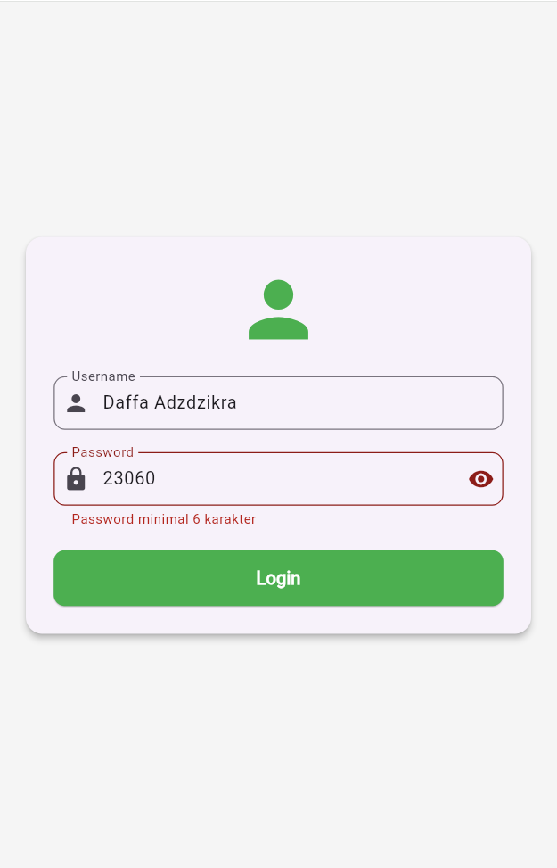
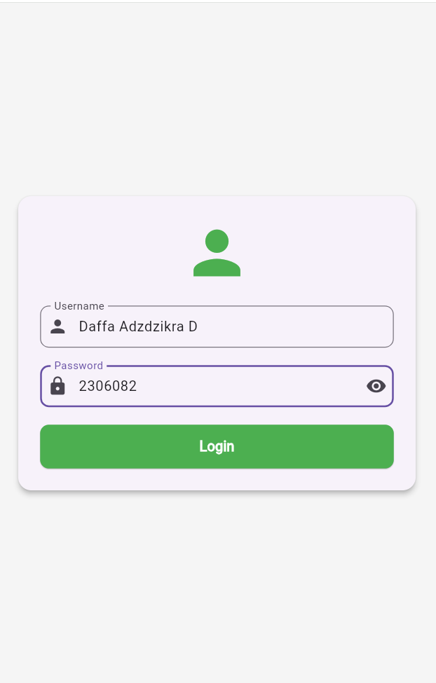
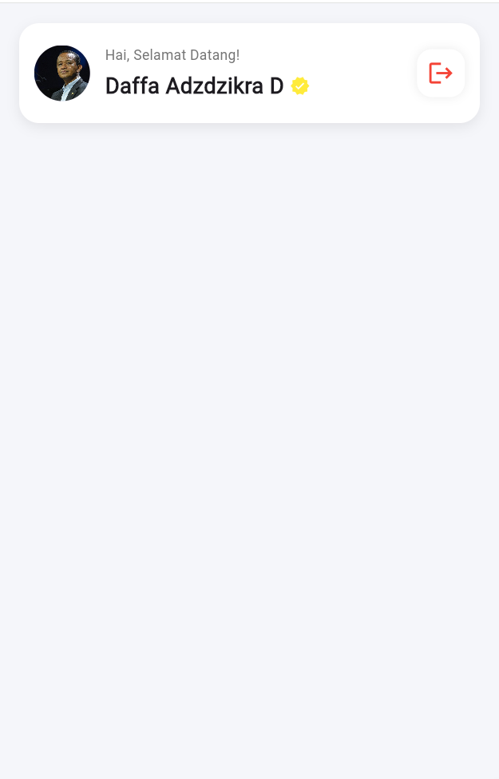

# Aplikasi Login & Session dengan Shared Preferences (Pertemuan 10)

Projek Flutter ini dibuat untuk mendemonstrasikan implementasi autentikasi sederhana (Login/Logout) serta manajemen session pengguna secara lokal menggunakan package `shared_preferences`. Projek ini menyimpan status login (`isLogin`) dan nama pengguna (`username`) secara persisten, sehingga sesi pengguna tetap terjaga meskipun aplikasi ditutup dan dibuka kembali.

---

## 📸 Tangkapan Layar (Screenshots)

Berikut adalah alur tampilan aplikasi berdasarkan gambar yang diberikan. Pastikan Anda menyimpan ketiga gambar tersebut ke dalam direktori `assets/` projek dengan nama file yang sesuai agar dapat ditampilkan pada dokumen ini:

|                   1. Validasi Password Kurang dari 6 Karakter                    |                            2. Input Login Valid                             |                                3. Halaman Beranda (Home Page)                                 |
| :------------------------------------------------------------------------------: | :-------------------------------------------------------------------------: | :-------------------------------------------------------------------------------------------: |
|                                                          |                                                     |                                                                       |
| _Menunjukkan validasi form gagal karena password terlalu pendek (< 6 karakter)._ | _Mengisi username dan password yang memenuhi syarat untuk masuk ke sistem._ | _Berhasil masuk, menampilkan nama pengguna secara dinamis dari memori lokal dan opsi Logout._ |

---

## 📂 Struktur Berkas Kode Utama

Aplikasi ini berpusat pada tiga file Flutter utama:

1. **[main.dart](file:///d:/KAMPUS/SEMESTER%206/PRAK%20PEMROGRAMAN%20MOBILE/pertemuan10_2306082/lib/main.dart)**: Mengatur pengecekan status login saat aplikasi pertama kali dijalankan (inisialisasi awal).
2. **[login_page.dart](file:///d:/KAMPUS/SEMESTER%206/PRAK%20PEMROGRAMAN%20MOBILE/pertemuan10_2306082/lib/pages/login_page.dart)**: Menyediakan form input nama dan password beserta validasi input, serta menyimpan data login ke penyimpanan lokal.
3. **[home_page.dart](file:///d:/KAMPUS/SEMESTER%206/PRAK%20PEMROGRAMAN%20MOBILE/pertemuan10_2306082/lib/pages/home_page.dart)**: Menampilkan data pengguna yang masuk dan menyediakan tombol logout untuk menghapus session data.

---

## ⚙️ Apa itu Shared Preferences?

`shared_preferences` adalah plugin Flutter yang digunakan untuk menyimpan data sederhana bertipe key-value secara persisten pada memori internal perangkat (seperti `SharedPreferences` pada Android dan `NSUserDefaults` pada iOS).

### Mengapa Menggunakan Shared Preferences?

- **Persistensi Sederhana**: Cocok untuk menyimpan pengaturan aplikasi (setting), status login (session token/flag), tema gelap/terang (dark/light mode), dan data ringan lainnya.
- **Asinkron & Cepat**: Operasi baca/tulis dilakukan secara asinkron (`async`/`await`) sehingga tidak memblokir thread UI utama.
- **Mudah Diintegrasikan**: Tidak membutuhkan setup database yang rumit seperti SQLite.

---

## 💻 Penjelasan & Alur Kode

### 1. Inisialisasi & Pengecekan Login Awal ([main.dart](file:///d:/KAMPUS/SEMESTER%206/PRAK%20PEMROGRAMAN%20MOBILE/pertemuan10_2306082/lib/main.dart))

Di dalam file [main.dart](file:///d:/KAMPUS/SEMESTER%206/PRAK%20PEMROGRAMAN%20MOBILE/pertemuan10_2306082/lib/main.dart), method `checkLogin()` dipanggil secara otomatis saat state diinisialisasi (`initState()`).

- Fungsi ini bertugas mengambil data `isLogin` dari `SharedPreferences`. Jika data belum ada, maka akan default bernilai `false`.
- Selama proses pengambilan data berlangsung, aplikasi menampilkan `CircularProgressIndicator` (`isLoading = true`).
- Setelah selesai, aplikasi mengarahkan pengguna secara otomatis ke [HomePage](file:///d:/KAMPUS/SEMESTER%206/PRAK%20PEMROGRAMAN%20MOBILE/pertemuan10_2306082/lib/pages/home_page.dart) jika sudah masuk sebelumnya, atau ke [LoginPage](file:///d:/KAMPUS/SEMESTER%206/PRAK%20PEMROGRAMAN%20MOBILE/pertemuan10_2306082/lib/pages/login_page.dart) jika belum.

```dart
Future<void> checkLogin() async {
  final prefs = await SharedPreferences.getInstance();
  isLogin = prefs.getBool('isLogin') ?? false;
  setState(() {
    isLoading = false;
  });
}
```

### 2. Validasi & Proses Menyimpan Data ([login_page.dart](file:///d:/KAMPUS/SEMESTER%206/PRAK%20PEMROGRAMAN%20MOBILE/pertemuan10_2306082/lib/pages/login_page.dart))

Halaman ini menggunakan widget `Form` dengan `GlobalKey<FormState>` untuk mengontrol validasi.

- **Validasi**:
  - Username tidak boleh kosong.
  - Password tidak boleh kosong dan harus minimal 6 karakter (seperti yang terlihat pada gambar pertama).
- **Menyimpan Session**:
  Jika validasi sukses, method `login()` akan dipanggil. Di dalamnya, kita membuka instance `SharedPreferences` dan menyimpan data berupa:
  1. `isLogin` bernilai `true` (menyatakan pengguna telah masuk).
  2. `username` berupa teks yang diinputkan pengguna.

```dart
Future<void> login() async {
  if (_formKey.currentState!.validate()) {
    final prefs = await SharedPreferences.getInstance();
    await prefs.setBool('isLogin', true);
    await prefs.setString('username', usernameController.text);
    if (!mounted) return;
    Navigator.pushReplacement(
      context,
      MaterialPageRoute(builder: (_) => const HomePage()),
    );
  }
}
```

### 3. Membaca & Menghapus Data Session ([home_page.dart](file:///d:/KAMPUS/SEMESTER%206/PRAK%20PEMROGRAMAN%20MOBILE/pertemuan10_2306082/lib/pages/home_page.dart))

Halaman ini menampilkan sambutan hangat kepada pengguna yang namanya diambil dari penyimpanan lokal.

- **Membaca Data**:
  Pada method `getUser()`, kita membaca data string dengan key `'username'`. Nilai tersebut disimpan ke variabel `username` lalu memicu pembaruan UI via `setState()`.
- **Menghapus Data (Logout)**:
  Saat ikon logout diklik, fungsi `logout()` dijalankan untuk menghapus seluruh data yang tersimpan di dalam penyimpanan lokal melalui `prefs.clear()`. Setelah itu, pengguna akan dilempar kembali ke halaman login.

```dart
// Membaca Data
Future<void> getUser() async {
  final prefs = await SharedPreferences.getInstance();
  setState(() {
    username = prefs.getString('username') ?? '';
  });
}

// Menghapus Data (Logout)
Future<void> logout() async {
  final prefs = await SharedPreferences.getInstance();
  await prefs.clear();
  if (!mounted) return;
  Navigator.pushReplacement(
    context,
    MaterialPageRoute(builder: (_) => const LoginPage()),
  );
}
```

---

## 🚀 Cara Menjalankan Projek

1. Pastikan Flutter SDK sudah terinstal di komputer Anda.
2. Jalankan perintah berikut untuk mengunduh semua dependency yang dibutuhkan (termasuk `shared_preferences`):
   ```bash
   flutter pub get
   ```
3. Jalankan aplikasi pada emulator atau perangkat fisik Anda:
   ```bash
   flutter run
   ```
